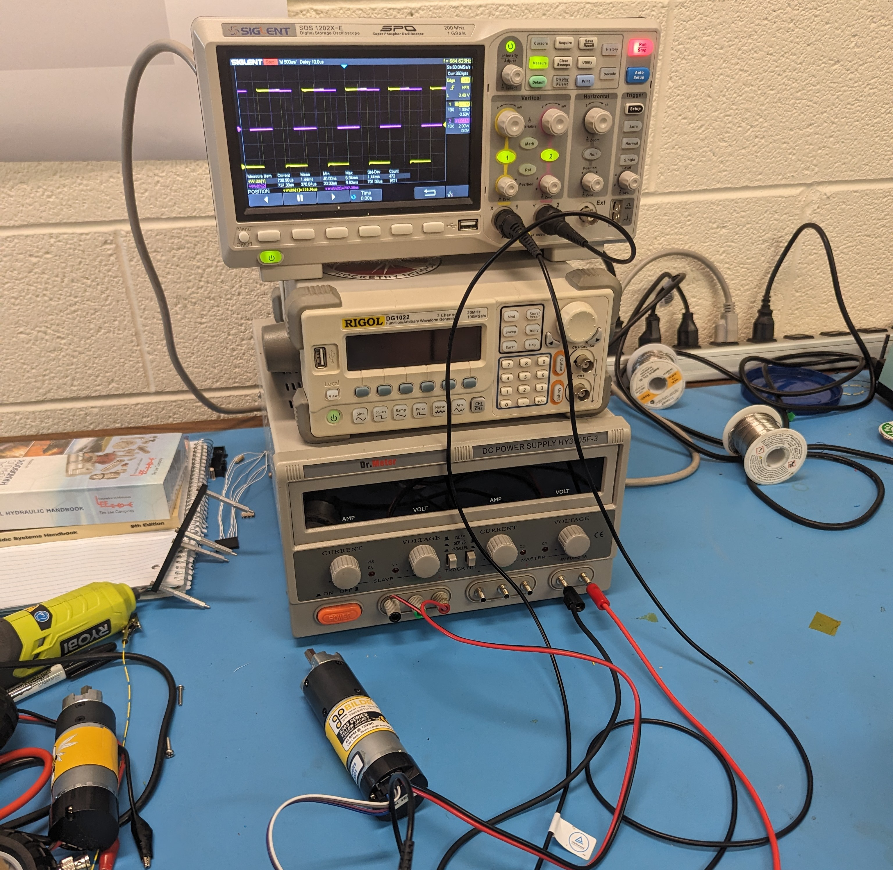
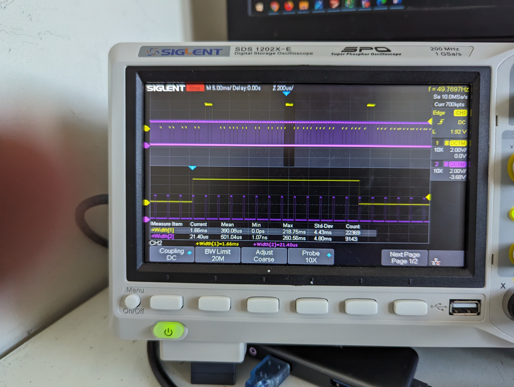

# Question #2

Note that your answers for this question will be checked for consistency with your
project submission. I don't expect 100% consistency, but it should be reasonable.

a) Please indicate your responsibilities for the MECH 471 / 6621 project in point form.

b) Describe in detail what results you have completed for each of the responsibilities
(from part a)) and give your detailed ideas / plans / preliminary results for completing
the remaining tasks. Please supply up to 3-5 pages of information (text, diagrams,
figures, equations, flow charts, code samples, etc.). Note that you don't have to
complete all your stated plans in the actual project.

## a)

For the project, I used it as a way to learn the course material, and as such wrote my own drivers for various different
sensors.

- Initial implementation of the ultrasonic sensors
- Writing a PWM driver for the L298 H-Bridge we are using (this was shared as it was a basic task and good to learn how
  to use PWM).
- Designing method of reading speed from motor encoders
- Combining servo and motor control onto a single timer.

## b)

I am responsible for integrating the various sensors together, and ensuring they will all function together properly
with the limited resources the arduino has.

### Ultrasonic Sensors

Another area where I had worked on, was implementing code for ultrasonic sensors. This is something I had started early
in the semester, and my first attempts were simply to replicate what the Arduino libraries did. This led me to an
interesting discovery about the inefficiencies of that library, where while it is timing the pulse it is unable to
execute any other code. The first implementation I had written used the same method.

This method triggers the pulse, and remains the same:

```C++
void ultrasonicDriver::triggerUltrasound() const {
    // Turns off pin if it was on before
    *portOutputRegister(digitalPinToPort(triggerPin)) &= ~digitalPinToBitMask(triggerPin);
    _delay_us(10);
    *portOutputRegister(digitalPinToPort(triggerPin)) |= digitalPinToBitMask(triggerPin);  // Turns on pin for 10 us
    _delay_us(10);
    *portOutputRegister(digitalPinToPort(triggerPin)) &= ~digitalPinToBitMask(triggerPin);  // Turns off pin again
}
```

Where as this is the portion which listens to the echo back.

```C++
float Ultrasonic::pollSensor() {
    triggerUltrasound();

    stopInterrupts();
    float duration = measurePulse(echoPin, HIGH, 23529);
    startInterrupts();
    if (duration != 0){
        sensorDistance = (duration/ 5.88235f);
    }
    return sensorDistance;
}
```

To improve this, interrupts can be used, which was the next iteration of it.
interrupts to trigger a function to time the duration, however nothing more. The following interrupt was called:

```C++
ISR(ULTRASONIC_SENSORS_INT_vect) {
    volatile uint8_t newVal = PINB & ULTRASONIC_SENSOR_INTERRUPT_MASK;
    ultrasonicSensors.interruptTrigger(OLD_INT_BANK ^ newVal, micros());
    OLD_INT_BANK = newVal;
}
```

This interrupt calls the `Ultrasonic::interruptTrigger`, which has a few jobs to do. A limitation of the Atmega328P MCU,
is that it is unable to set pin specific interrupts with the exception of INT0 and INT1. There are three ultrasonic
sensors, so this was not an option. This meant there needed to be logic to both determine which pin had changed, and if
it was the pin we currently cared about. All three sensors were always powered and plugged in, and would often receive
pulses from other sensors. To solve this, firstly only the pins we cared about were stored, and then XOR'd with the old
register values, which would return a value such as ```0b00000110```, if the pins in the second and third place had
changed. Next this was passed to the function below, which validated if the bit that changed matched the current
sensor's bit. This is shown below:

```C++
void Ultrasonic::interruptTrigger(uint8_t pinMask, uint32_t time) {
    if (((pinMask & _BV(ULTRASONIC_SENSOR0_INT)) && (currentPolledSensor == 0)) ||
        ((pinMask & _BV(ULTRASONIC_SENSOR1_INT)) && (currentPolledSensor == 1)) ||
        ((pinMask & _BV(ULTRASONIC_SENSOR2_INT)) && (currentPolledSensor == 2))) {
        if (!timing) {
            startTime = time;
            timing = true;
        } else {
            endTime = time;
            timing = false;
        }
    }
}
```

While this did provide an improvement in speed, and not delaying the entire process for 10s of ms at a time, it did
still have some issues, including relying on `micros()`. After this point, Ruben took over the ultrasonic sensors and
wrote a better way to make them all work together.

### Motor Encoder Reading

The motor encoders and wheel encoders we used generate two pulses, 90 degrees out of phase, to allow for determining
both the speed and direction of the wheel. This is shown in the image below.



The initial method which Jonathan looked into using was interrupts to time each pulse, and determining the speed and
direction from the timing of the pulse, however the front wheel encoders would send out pulses at over 5 kHz, twice per
wheel. This would generate 25000 interrupts or more per second, and also cause issues with inaccuracies in timing
building up.

To improve both the performance, and avoid having noise and delays being significant, I had written code to instead
count the number of pulses, and every 10 or more ms, determine the number of revolutions per second. The register level
interrupt's code is as follows:

```C++
uint8_t oldInt = 0;
/**
 * ISR is used for pulse detection and counting, and will return speed.
 */
ISR(PCINT1_vect) {
    PORTB |= _BV(PB5);
    uint8_t changedBits = oldInt ^ PORTC;

    if (changedBits & _BV(digitalPinToBitMask(BACK_ENCODER_A))) {
        wheelEncoders.processInterrupt(BACK_ENCODER);
    }
    if (changedBits & _BV(digitalPinToBitMask(BACK_ENCODER_B))) {
        wheelEncoders.processInterrupt(BACK_ENCODER);
    }

    if (changedBits & _BV(digitalPinToBitMask(LEFT_WHEEL_ENCODER_A))) {
        wheelEncoders.processInterrupt(LEFT_ENCODER);
    }
    if (changedBits & _BV(digitalPinToBitMask(LEFT_WHEEL_ENCODER_B))) {
        wheelEncoders.processInterrupt(LEFT_ENCODER);
    }

    if (changedBits & _BV(digitalPinToBitMask(RIGHT_WHEEL_ENCODER_A))) {
        wheelEncoders.processInterrupt(RIGHT_ENCODER);
    }
    if (changedBits & _BV(digitalPinToBitMask(RIGHT_WHEEL_ENCODER_B))) {
        wheelEncoders.processInterrupt(RIGHT_ENCODER);
    }
}
```

This function calls a simple function, which simply increases a count by one. This method was chosen for it's speed.

```C++
void encoders::processInterrupt(WheelEncoder whichEncoder) {
    switch (whichEncoder) {
        case BACK_ENCODER:
            backEncoderPulseCount++;
            break;
        case LEFT_ENCODER:
            leftEncoderPulseCount++;
            break;
        case RIGHT_ENCODER:
            rightEncoderPulseCount++;
            break;
    }
}
```

The actual speed calculations are done independently, outside of the ISR and instead in the main loop. These
calculations are more intensive, and only need to be done at most 100 times/second.

```C++
void encoders::calculateSpeeds() {
    // Calculate the speed based on timeElasped/pulseCount
    uint32_t currentTime = micros();
    uint32_t deltaTime = currentTime - lastTime;

    if (deltaTime < MINIMUM_US) return; // Don't re-calculate speed if below this time.

    // Calculate as rev/s
    backEncoderSpeed = 1e6 * (backEncoderPulseCount * BACK_ENCODER_PULSES_PER_REV) / deltaTime;
    leftEncoderSpeed = 1e6 * (leftEncoderPulseCount * WHEEL_ENCODER_PULSES_PER_REV) / deltaTime;
    rightEncoderSpeed = 1e6 * (rightEncoderPulseCount * WHEEL_ENCODER_PULSES_PER_REV) / deltaTime;

    lastTime = currentTime;
}
```

#### Encoder Reading Troubles:

Once this was implemented, the first attempt to test it resulted in no outputs. When the oscilloscope was used to probe
the outputs, the following wave form was shown. Note that the voltage ranges from 0 mV to -200 mV. This is far below
what an Arduino will read on its digital pins.


Upon further reading of the datasheets, it was discovered that we needed to enable a pull-up resistor, to get the signal
to go between 0 and 5 V. This is accomplished by both setting the data direction to output, and setting the `PORTC`
register high.

```C++
        // Enables the internal pull-up resistor
    DDRC |= _BV(digitalPinToBitMask(BACK_ENCODER_A))        |
            _BV(digitalPinToBitMask(BACK_ENCODER_B))        |
            _BV(digitalPinToBitMask(LEFT_WHEEL_ENCODER_A))  |   
            _BV(digitalPinToBitMask(LEFT_WHEEL_ENCODER_B))  |
            _BV(digitalPinToBitMask(RIGHT_WHEEL_ENCODER_A)) |   
            _BV(digitalPinToBitMask(RIGHT_WHEEL_ENCODER_B));

    // Enables the internal pull-up resistor
    PORTC |= _BV(digitalPinToBitMask(BACK_ENCODER_A))      |   
            _BV(digitalPinToBitMask(BACK_ENCODER_B))       |
            _BV(digitalPinToBitMask(LEFT_WHEEL_ENCODER_A)) | 
            _BV(digitalPinToBitMask(LEFT_WHEEL_ENCODER_B)) |
            _BV(digitalPinToBitMask(RIGHT_WHEEL_ENCODER_A))| 
            _BV(digitalPinToBitMask(RIGHT_WHEEL_ENCODER_B));
```

### Implementing servo and motor control on a single timer:

One of the things I worked on was to implement control for both a servo and a motor on the same timer, timer2. This is
because we are using timer1 to time various events in our program, and had been using timer0 (and the built-in arduino
libraries) for debugging. Due to this, the only way we could control both of the sensors was using a single timer.

The first major issue, besides just getting it to work :) was the vastly different frequencies of signals which the two
items wanted. The H-Bridge we are using to drive the motor operates around 8 kHz, while the servo wants a pulse every 20
ms (50 Hz). This is 160 times slower, and both posed a problem and offered a solution. Because the servo operates as
such a slower frequencies compared to the frequency the timer was running at, it is possible to manually scale the
frequency of the output to go off every 160 cycles.

The setup for the timer is as follows, where the B side of timer2, pin D3, was directly controlled by the timer itself,
and to change the speed the `OCR2B` register could simply be written to. This was important due to the high frequency,
and the fact that doing this pulse modulation in software alone would be challenging. Additionally, the prescaler was
set to 8, which gave a frequency of 7812.5 Hz. The code used to initialize the timer is shown below.

```C++
// Timer2:
//      Used by motor and servo control
TCCR2A = 0;
TCCR2A |= (1 << COM2B1); // Enables PWM output for timer2 side B
TCCR2A |= (1 << WGM21) | (1 << WGM20); // Enables fast PWM Mode

TCCR2B = 0b010; // Sets Prescaler to 8 (~8 kHz)
OCR2B = (uint8_t) 0; // Set PWM to 0%

// Setup interrupts
TIMSK2 = _BV(TOIE2); // Enable the overflow interrupt
```

In addition to setting up the timer to pulse pin D3, the overflow interrupt was also enabled. This is where the counting
will happen for the servo to allow for manual control. This is shown in the code block below, where the interrupt counts
up until it hits two thresholds, where it acts, either the `PULSE_SIZE`, which is the width of the high portion of the
pulse, or the `ROLLOVER_SCALER_COUNT`, which is a set value to cause it to roll over every 20 ms. (Because it's 7.8 kHz,
it's not exactly 160).

```C++
// Controls for the Servo
volatile const uint8_t ROLLOVER_SCALER_COUNT = 156;
volatile uint8_t ServoCurrentScalerCount = 0;
ISR(TIMER2_OVF_vect) {
    ServoCurrentScalerCount++;
    if (ServoCurrentScalerCount > ROLLOVER_SCALER_COUNT) {
        PORTD |= _BV(PD5);
        ServoCurrentScalerCount = 0;
    } else if (ServoCurrentScalerCount > PULSE_SIZE) {
        PORTD &= ~_BV(PD5);
    }
}
```

Additionally, the `PULSE_SIZE` variable was controlled by another function, which validated the input was valid, and
then scaled it from degrees between 0 and 90, to the number of cycles of the interrupt.

```C++
int setAngle(uint8_t angleAmount) {
    if ((angleAmount < 0) || (angleAmount > 90)) { // Invalid angle to attempt to set to, do nothing.
        return -1;
    }

    PULSE_SIZE = (uint8_t) (angleAmount * ANGLE_CONV + PULSE_MIN);

    return 0;
}
```

When debugged and ran, this allowed for two very different frequency of pulses to be generated, as shown in the image
below. In the image below, the yellow trace, CH1, represents the pulse signal for the servo, while the purple trace,
CH2, is the motor PWM. On the top is the zoomed out signal showing the stable pulses, and on the bottom it is zoomed in
to be able to see the motor PWM behaviour.  

